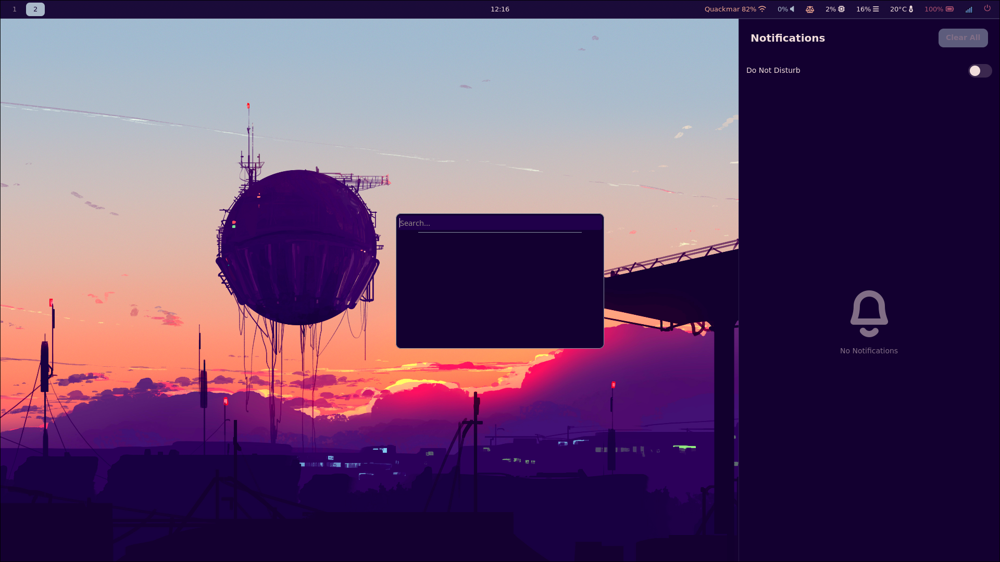
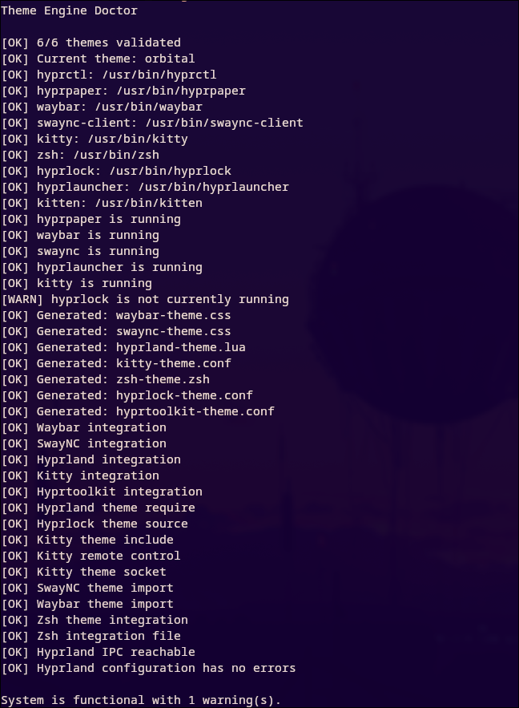

# Arch Theme Manager

A modular theme orchestrator for **Arch Linux + Hyprland**.

Arch Theme Manager applies a single theme across multiple desktop components from one unified theme manifest.

## Preview

### Orbital Desktop

<p align="center">
  
</p>

### Theme Manager Health Check

<p align="center">
  
</p>

## Supported Integrations

- Hyprland
- Hyprpaper
- Waybar
- SwayNC
- Kitty
- Zsh
- Hyprlock
- Hyprlauncher / Hyprtoolkit

## Features

- Single theme manifest
- Live theme switching
- Theme inheritance
- Deep configuration merging
- Theme validation
- Theme installation
- Theme copying
- Theme renaming
- Theme removal
- Current and previous theme state
- Compensating rollback
- XDG-compliant paths
- Integration health checks
- Migration-safe installer
- Automatic next/previous theme rotation

## Installation

Clone the repository:

```bash
git clone https://github.com/adamaarbouba/Arch_theme_manager.git
cd Arch_theme_manager
```

Run:

```bash
./scripts/install.sh
```

Reload Zsh:

```bash
source ~/.zshrc
```

Verify:

```bash
which themectl
themectl current
themectl doctor
```

The CLI is installed at:

```text
~/.local/bin/themectl
```

## CLI

List installed themes:

```bash
themectl list
```

Show a resolved theme:

```bash
themectl show portal
```

Validate a theme:

```bash
themectl validate portal
```

Apply a theme:

```bash
themectl apply portal
```

Show the active theme:

```bash
themectl current
```

Cycle themes:

```bash
themectl next
themectl previous
```

Install a theme:

```bash
themectl install-theme /path/to/theme
```

Install with a custom name:

```bash
themectl install-theme \
    /path/to/theme \
    --name portal
```

Replace an existing theme:

```bash
themectl install-theme \
    /path/to/theme \
    --name portal \
    --force
```

Copy an installed theme:

```bash
themectl copy-theme portal portal-copy
```

Rename an installed theme:

```bash
themectl rename-theme portal gateway
```

Remove an installed theme:

```bash
themectl remove-theme portal
```

Force removal of the active theme:

```bash
themectl remove-theme portal --force
```

Check the system:

```bash
themectl doctor
```

## Theme Structure

Themes are stored in:

```text
~/.config/arch-theme-manager/themes/
```

Example:

```text
portal/
├── theme.json
└── wallpaper.png
```

A public example theme is included at:

```text
themes/example/
```

## Theme Management

Arch Theme Manager supports the theme lifecycle directly through the CLI:

```text
install
   ↓
copy
   ↓
validate
   ↓
apply
   ↓
rename
   ↓
remove
```

Example:

```bash
themectl install-theme themes/example --name custom
themectl copy-theme custom custom-alt
themectl validate custom-alt
themectl apply custom-alt
themectl rename-theme custom-alt final-theme
themectl remove-theme final-theme
```

`copy-theme` leaves the original theme untouched and creates a separate theme directory with an updated manifest name.

The currently active theme is protected from accidental removal unless `--force` is explicitly used.

## Project Paths

```text
Themes:
~/.config/arch-theme-manager/themes/

Generated:
~/.config/arch-theme-manager/generated/

State:
~/.local/state/arch-theme-manager/

Application:
~/.local/share/arch-theme-manager/

CLI:
~/.local/bin/themectl
```

## Development

Create a virtual environment:

```bash
python -m venv .venv
source .venv/bin/activate
```

Install development dependencies:

```bash
pip install -e ".[dev]"
```

Run the full test suite:

```bash
pytest
```

Run a specific test module:

```bash
pytest -v tests/test_theme_copier.py
```

## Documentation

Detailed documentation is available in:

```text
docs/installation.md
docs/themes.md
docs/architecture.md
```

## Migration

Older installations using:

```text
~/.config/hypr/theme-engine
```

can be migrated by the installer.

Existing configuration files are backed up before integration changes are made.

Keep the old installation until the migrated setup has been verified.

## License

MIT
